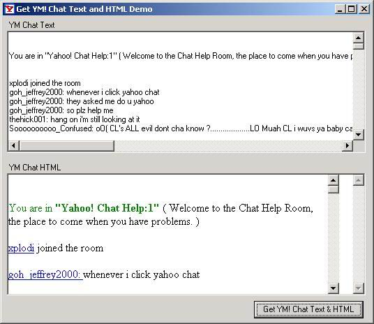



## Get YM\! Chat Text & HTML from "Internet Explorer\_Server" object

### Description

This project will demonstrate how to get the DOM object from an "Internet Explorer_Server" window. And it also shows you how to use that object to get at the TEXT and HTML of the DOM object. This code also demonstrates how to use the EnumWindows and EnumChildWindows API calls.
 
### More Info
 
This is my first submission. I hope you like it.

             |
---                |---
**Submitted On**   |2002-02-22 02:56:30
**By**             |[James Johnston](https://github.com/Planet-Source-Code/PSCIndex/blob/master/ByAuthor/james-johnston.md)
**Level**          |Advanced
**User Rating**    |5.0 (20 globes from 4 users)
**Compatibility**  |VB 6\.0
**Category**       |[OLE/ COM/ DCOM/ Active\-X](https://github.com/Planet-Source-Code/PSCIndex/blob/master/ByCategory/ole-com-dcom-active-x__1-29.md)
**World**          |[Visual Basic](https://github.com/Planet-Source-Code/PSCIndex/blob/master/ByWorld/visual-basic.md)
**Archive File**   |[Get\_YM\!\_Ch567922222002\.zip](https://github.com/Planet-Source-Code/james-johnston-get-ym-chat-text-html-from-internet-explorer-server-object__1-32017/archive/master.zip)

